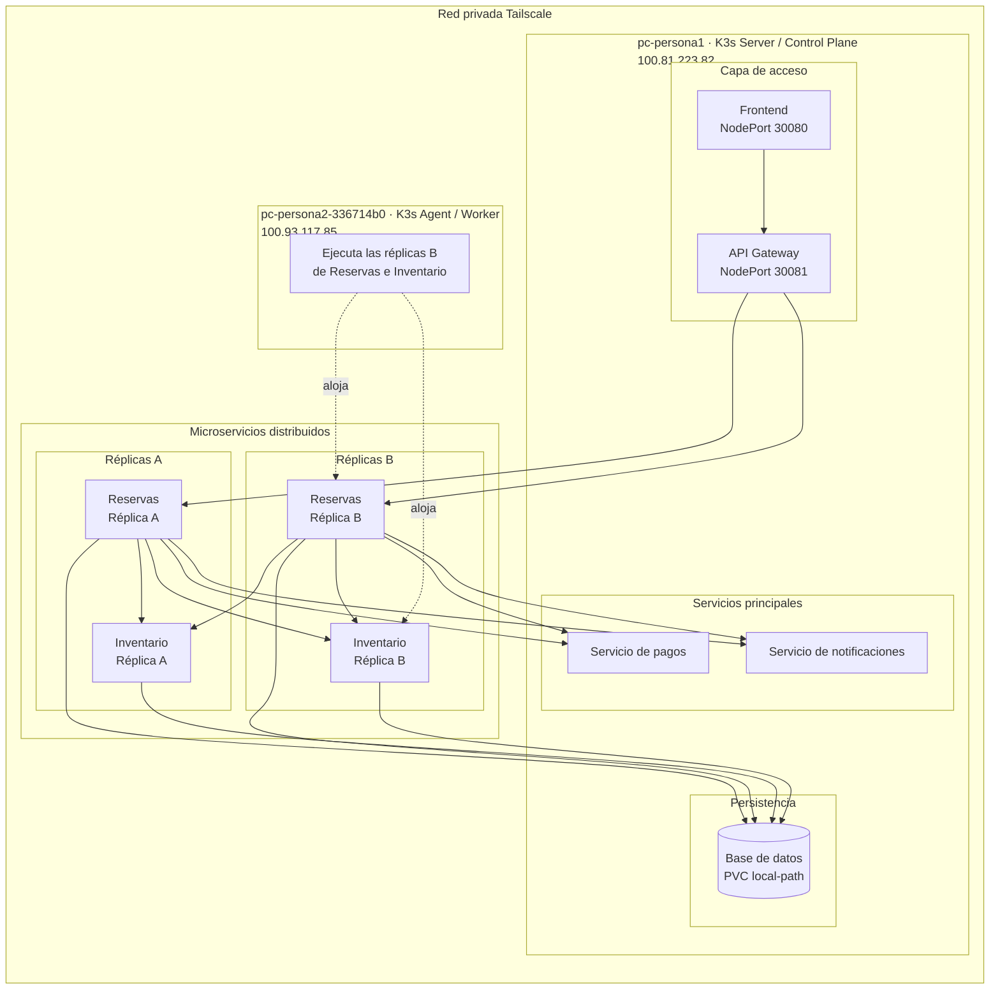

```mermaid
  flowchart TB
    subgraph tailscale["Red privada Tailscale"]
      direction TB
  
      %% =========================
      %% NODO PRINCIPAL
      %% =========================
      subgraph p1["pc-persona1 · K3s Server / Control Plane<br/>100.81.223.82"]
        direction TB
  
        subgraph access["Capa de acceso"]
          direction LR
          fe["Frontend<br/>NodePort 30080"]
          gw["API Gateway<br/>NodePort 30081"]
        end
  
        subgraph core["Servicios principales"]
          direction LR
          pay["Servicio de pagos"]
          notif["Servicio de notificaciones"]
        end
  
        subgraph storage["Persistencia"]
          db[("Base de datos<br/>PVC local-path")]
        end
      end
  
      %% =========================
      %% MICROSERVICIOS DISTRIBUIDOS
      %% =========================
      subgraph services["Microservicios distribuidos"]
        direction LR
  
        subgraph replicasA["Réplicas A"]
          direction TB
          res1["Reservas<br/>Réplica A"]
          inv1["Inventario<br/>Réplica A"]
        end
  
        subgraph replicasB["Réplicas B"]
          direction TB
          res2["Reservas<br/>Réplica B"]
          inv2["Inventario<br/>Réplica B"]
        end
      end
  
      %% =========================
      %% NODO WORKER
      %% =========================
      subgraph p2["pc-persona2-336714b0 · K3s Agent / Worker<br/>100.93.117.85"]
        direction TB
        workerInfo["Ejecuta las réplicas B<br/>de Reservas e Inventario"]
      end
    end
  
    %% =========================
    %% FLUJO DE COMUNICACIÓN
    %% =========================
    fe --> gw
  
    gw --> res1
    gw --> res2
  
    res1 --> inv1
    res1 --> inv2
    res2 --> inv1
    res2 --> inv2
  
    res1 --> pay
    res2 --> pay
  
    res1 --> notif
    res2 --> notif
  
    res1 --> db
    res2 --> db
    inv1 --> db
    inv2 --> db
  
    %% Relación visual con el worker
    workerInfo -. aloja .-> res2
    workerInfo -. aloja .-> inv2
```

  
