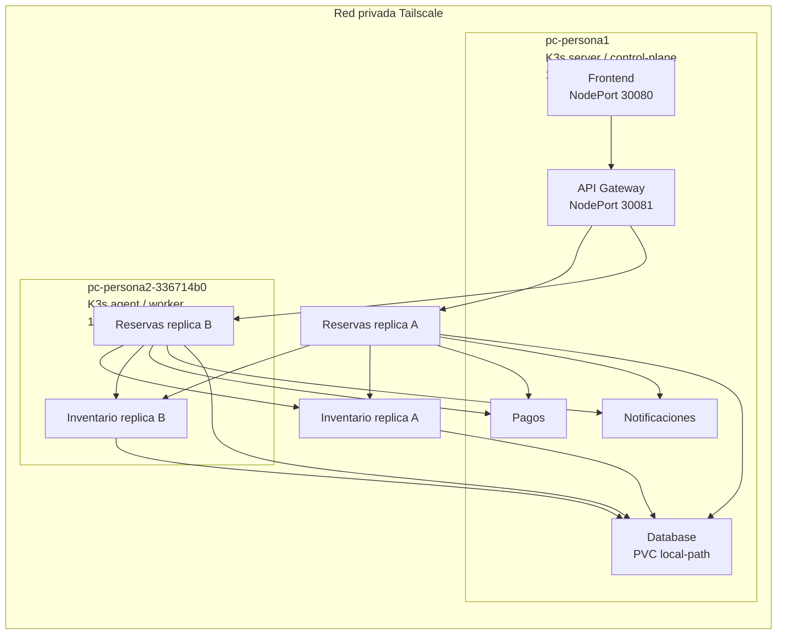

# Arquitectura Multi-Nodo

## Diagrama

## Distribución esperada

- `api-gateway`, `frontend`, `pagos`, `notificaciones` y `database` pueden quedar en `pc-persona1`.
- `reservas` tiene `replicas: 2` con `podAntiAffinity` por `kubernetes.io/hostname`.
- `inventario` tiene `replicas: 2` con `podAntiAffinity` por `kubernetes.io/hostname`.
- Con ambos nodos `Ready`, una réplica de `reservas` y una de `inventario` deben caer en cada nodo.
- Con solo un nodo `Ready`, el scheduler dejará una réplica `Pending`, lo cual evidencia que el requisito multi-nodo no fue validado aún.

## Flujo de compra

1. El cliente entra por `frontend` o llama directo al `api-gateway`.
2. `api-gateway` reenvía `POST /api/comprar` a `reservas`.
3. `reservas` intenta reservar stock en `inventario`.
4. `inventario` centraliza disponibilidad en `database`.
5. Si hay stock, `reservas` invoca a `pagos`.
6. Si `pagos` falla o tarda, `reservas` libera inventario y responde error controlado.
7. Si `pagos` responde bien, `reservas` registra booking en `database`.
8. `reservas` intenta `notificaciones`; si falla, deja warning no crítico.

## Persistencia

- `database` usa `PersistentVolumeClaim` `database-pvc`.
- `storageClassName: local-path`.
- Montaje en `/data`.
- Archivo persistido: `/data/ticket-system.json`.
